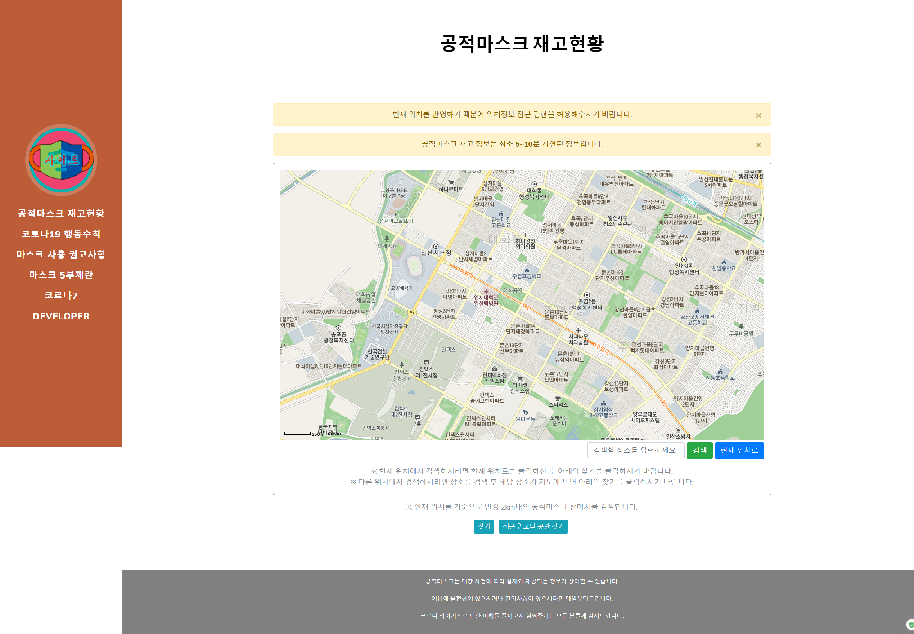
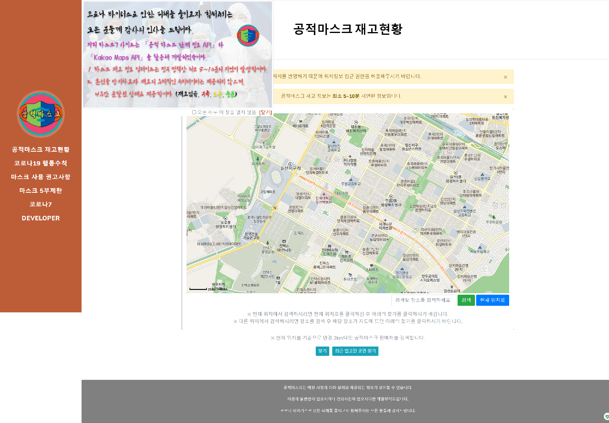
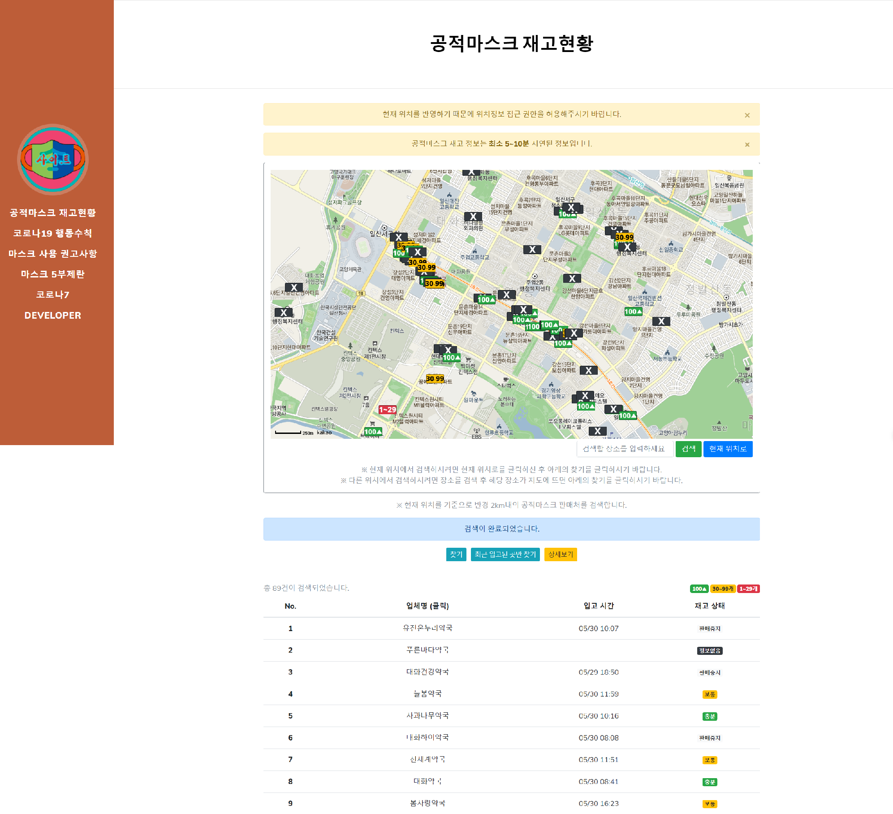
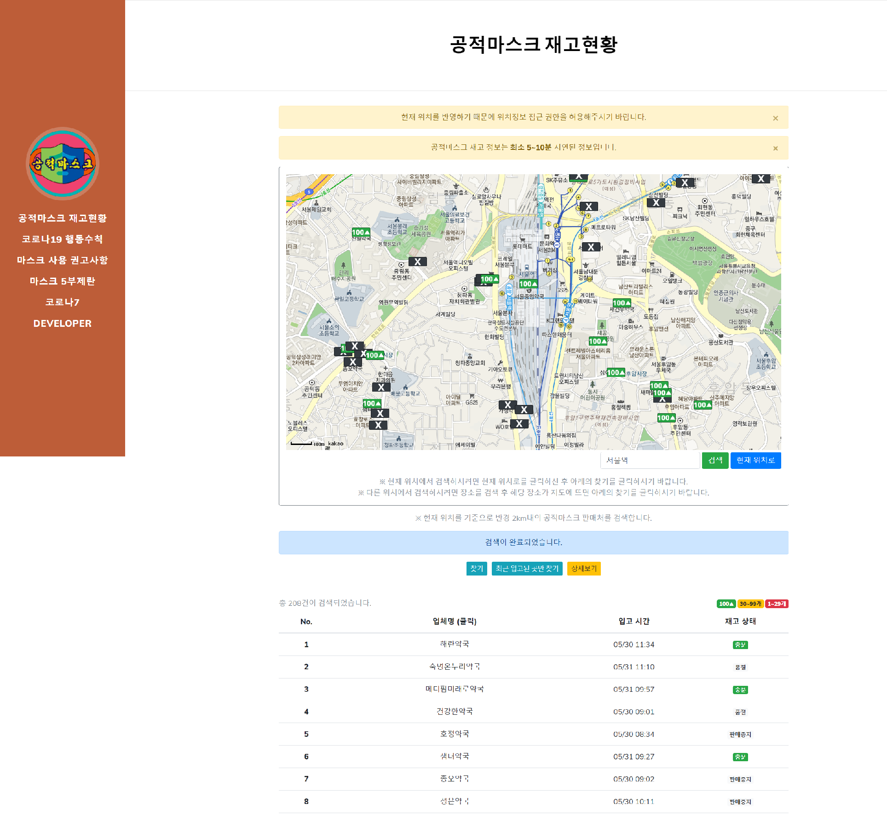

# Mask7
------------------
## 1. 목차
```
.MASK7 공적마스크 재고 확인 사이트
├── 1.목차
├── 2.URL
├── 3.개요
├── 4.특징
├── 5.사용법
|   ├── 5.1.개발 환경 & 개발 툴
|   └── 5.2.실행 방법
|       ├── 5.2.1 실행 환경 세팅
|       └── 5.2.2 실행
└── 6.스크린샷
    ├── 6.1.메인 화면
    ├── 6.2.레이어 팝업 화면
    ├── 6.3.현재 위치에서 반경 2km안의 마스크 재고 검색 화면
    └── 6.4.서울역을 검색하여 나온 위치에서 반경 2km안의 마스크 재고 검색 화면
```

## 2. URL 
# http://0254.duckdns.org:9090/mask7


### 공적마스크 제도가 종료되면서 현재 검색이 불가능합니다. 시연 영상을 아래의 링크에 올렸습니다.
### https://youtu.be/UIbvNGNCFdE


## 3. 개요
 - **Spring Framework**로 구현한 **공적마스크 재고 확인 사이트**입니다. 
 - 사이트에는 마스크 재고 확인, 마스크 5부제 정보, 개발자 정보 등의 기능이 구현되어 있습니다.
 - Maven, Log4j, Lombok, 카카오 API, 구글 API 등 다양한 라이브러리 및 유틸리티를 활용하였습니다. 
 
 
 
## 4. 특징
- 공적마스크 판매 정보 API (https://www.data.go.kr/dataset/15043025/openapi.do)를 이용했습니다.
- 위의 API에서 검색 반경 2km내의 모든 약국의 위치와 마스크 재고정보를 받아와 지도를 통해 출력합니다.
- 지도는 KaKao Maps API를 이용했습니다.
- 현재 위치가 아닌 다른 곳도 검색하여 해당 위치에 대한 마스크 재고 정보를 띄웁니다.
- 마스크의 재고 상태에 따라 서로 다른 이미지를 출력하며 검색결과에 나오는 약국명을 클릭하면 자세한 위치가 지도에 나옵니다.
- 입고된 지 1시간 이내인 최근 입고된 약국만 따로 검색이 가능합니다.
- Developer부분에는 구글 지도를 사용하는 api를 사용했습니다.
- 레이어 팝업을 적용하여 메인페이지에서 팝업을 띄우게 하였고 쿠키를 생성하여 일정 기간동안 팝업을 띄우지 않도록 했습니다.
- 반응형 웹페이지로 PC와 MOBILE등 각 기기에 맞도록 최적화된 화면을 보여줍니다.
- aws로 구동하며 도메인을 이용하여 어디에서나 http://0254.duckdns.org:9090/mask7 을 입력하면 접속이 가능하도록 하였습니다.


## 5. 사용법
### 5.1. 개발 환경 & 개발 툴
- Programing Language : HTML, CSS, JavaScript, jQuery, Java 8, JSP, Servlet
- Framework : Bootstrap, Spring 5.0.7
- API : 공적마스크 판매 정보 API, KaKao Maps API, Google Maps JavaScript API
- Server : Apache Tomcat 8.5
- OS: Windows 10 
-----------------------------------------------------------------------------
- Tool : Spring Tool Suite, VS code
- Graphic Tool : Adobe Photoshop CC


### 5.2. 실행 방법
#### 5.2.1 실행환경 세팅
```
# 1. Spring Tool Suite에 해당 Mask7프로젝트를 import 합니다.
# 2. kakao developers에 새로운 애플리케이션을 추가해 주신 후 앱 키를 받아 top.jsp에 있는 79번째 줄의 appkey부분을 수정하시기 바랍니다.
# 5. kakao developers의 플랫폼에서 사이트 도메인을 추가해 주시기 바랍니다.
# 4. 이렇게 하면 세팅은 완료됩니다.
```
#### 5.2.2 실행
```
# 1. 설정이 완료되면 server를 시작하고, 웹 사이트 주소 창에 http://localhost:8080/mask7을 입력하시면 됩니다. 
- 포트 번호(8080)는 본인의 컴퓨터에 설정된 톰캣의 포트번호로 변경해주시기 바랍니다. 
```


## 6. 스크린샷

### 6.1.메인 화면
 
 -------------

### 6.2. 레이어 팝업 화면
 
 -------------
 
 ### 6.3. 현재 위치에서 반경 2km안의 마스크 재고 검색 화면
 
 -------------
  
 ### 6.4. 서울역을 검색하여 나온 위치에서 반경 2km안의 마스크 재고 검색 화면
 
 -------------


-----------------------------------------------------------------------------
# 감사합니다!
